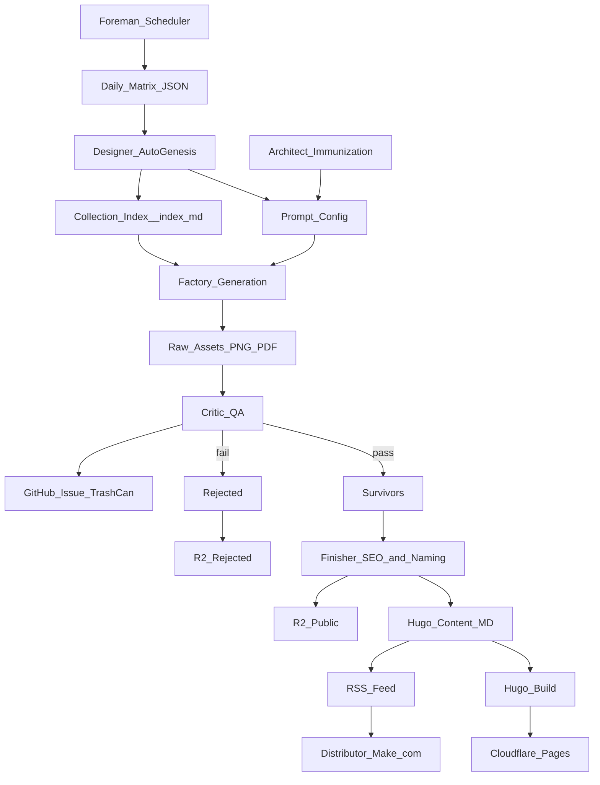

# Autonomy PRD: Dependency & Rollout Map (Phased + Gated)

This rollout plan is designed to be **safe-by-default** and compatible with the repo’s current daily workflow (`.github/workflows/daily-generate-and-optimize.yml`).

## Dependency graph (conceptual)

## Rollout principles (non-negotiable)
- **Idempotent steps**: reruns must not multiply content or mutate unrelated fields.
- **Disable switches**: every new agent/step must have a clean “off” switch (env var or workflow input).
- **Best-effort where safe**: SEO optimization can be best-effort; QA should be strict only after calibration.
- **No shared mutable state across parallel jobs** unless the state is scoped (per-collection/per-run) and persisted safely.

---

## Phase 0 (Baseline): Stabilize what exists today
**Goal**: treat the current pipeline as the “known good baseline” we can always revert to.

- **Entry criteria**: Daily workflow runs successfully for the current matrix and commits content.
- **Exit criteria**:
  - The generation manifest is produced consistently (`scripts/morning-routine/.runs/<runId>.json`).
  - SEO review is best-effort and never blocks commits (already true).
  - A single tracking issue is used consistently for run summaries (current workflow uses Issue #1).
- **Rollback**: none (this is baseline).

---

## Phase A (Foundations): Foreman + Designer as *non-destructive* preflight
**Goal**: introduce “Foreman” scheduling and “Auto-Genesis” collection scaffolding without touching production generation behavior.

- **What changes**:
  - Add Foreman that outputs a matrix JSON (no generation yet).
  - Add Designer that ensures missing collection infrastructure exists (prompt config + `_index.md`), but runs in **dry-run** first.
  - Support a Week 1 pattern where new categories (e.g., `fantasy/*`) are present as **dry_run_collections**: Foreman/Designer report on them, but production does not generate/publish them yet.

- **Disable switches (must exist)**:
  - `ENABLE_FOREMAN=0` → use existing hardcoded workflow matrix.
  - `ENABLE_DESIGNER=0` → do not create/modify configs or `_index.md`.
  - `DESIGNER_DRY_RUN=1` → logs intended changes only.

- **Entry criteria**:
  - Rollout schedule source is defined (which collections are active for the week).
  - “Collection exists” definition is explicit (folder + `_index.md` + prompt config).

- **Exit criteria**:
  - Foreman produces a deterministic matrix for a given day/key.
  - Designer dry-run produces predictable diffs; no “surprise edits” outside its scope.

- **Rollback**:
  - Flip `ENABLE_FOREMAN=0` and `ENABLE_DESIGNER=0`; pipeline reverts to baseline matrix generation.

---

## Phase B (Production safety): Critic QA introduced in *observe → enforce* steps
**Goal**: add vision QA with a simple 1-strike **fail-fast** rule without immediately risking false positives halting production.

### B1: Observe-only QA
- **Behavior**: Critic runs and produces QA verdicts and reasons, but **does not reject** assets.
- **Disable switches**:
  - `ENABLE_QA=0` → skip QA entirely.
  - `QA_MODE=observe` → never reject; only log.
- **Exit criteria**:
  - QA reasons stabilize and are actionable (low “unknown” rate).
  - A measurable false-negative/false-positive review loop exists (Issue log format + sampling approach).

### B2: Enforced 1-strike fail-fast
- **Behavior**: On the **first** failing asset in a collection, Critic:\n  - rejects it (routes to `rejected/`)\n  - logs the reason to the Trash Can issue\n  - **halts the collection** for the remainder of the run\n+Other collections continue normally.
- **Disable switches**:
  - `QA_MODE=enforce_failfast`
- **Exit criteria**:
  - Rejections are correctly routed and logged with machine-parseable fields.
  - Survivors proceed end-to-end reliably.

- **Rollback (all B phases)**:
  - Flip `ENABLE_QA=0` (full rollback) or revert to `QA_MODE=observe`.

---

## Phase C (JIT Finishing): Separate “expensive/side-effectful” finishing from generation
**Goal**: make finishing operations happen only for survivors and remain retry-safe.

- **Key decision**: today, PDF generation happens during upload in `storage.ts`. PRD vNext should define whether:\n  - **C0 (Transitional)**: keep current behavior temporarily (PDF may exist even for rejected), or\n  - **C1 (True JIT)**: move PDF generation (and potentially final asset naming) into the post-QA finisher step.

- **Disable switches**:
  - `ENABLE_FINISHING=0` → publish raw draft content only (or skip rename steps).
  - `ENABLE_PDF=0` → do not generate PDFs (if PDF generation is moved to finishing).
  - `ENABLE_ASSET_RENAME=0` → keep temp asset names; only rename markdown.

- **Entry criteria**:
  - QA enforcement is stable (Phase B2+).
  - Finisher rules for naming and collisions are deterministic.

- **Exit criteria**:
  - Retries do not create duplicates (content or assets).
  - Survivors have consistent `image_url` and `download_url` (or a defined fallback if PDF fails).

- **Rollback**:
  - Flip finishing switches off; pipeline still generates content and commits markdown.

---

## Phase D (Feedback loops): Weekly Architect immunization
**Goal**: self-heal prompt configs based on failure patterns without destabilizing prompts.

- **Disable switches**:
  - `ENABLE_IMMUNIZATION=0`
  - `IMMUNIZATION_MAX_EDITS_PER_RUN=N` (cap changes)

- **Entry criteria**:
  - Trash Can logging format is stable and parseable.
  - Prompt config schema is versioned (so automated edits don’t drift).

- **Exit criteria**:
  - Immunization edits are small, bounded, and demonstrably reduce failure frequency.

- **Rollback**:
  - Disable immunization; revert configs via git if needed.

---

## Phase E (Syndication): Distributor (Make.com)
**Goal**: connect RSS → Pinterest posting with UTM tracking and monitoring.

- **Disable switches**:
  - `ENABLE_DISTRIBUTION=0` (Make.com scenario disabled / filter rule).

- **Entry criteria**:
  - RSS feed reliably includes the required fields (title, image, destination URL, description).
  - UTM schema is agreed and stable.

- **Exit criteria**:
  - Posts publish reliably; failures are visible and do not affect production generation.

---

## Cross-phase guardrails (gates you should enforce)
- **Budget/cost gate**: explicit daily ceiling, plus per-collection ceiling.
- **Safety gate**: deterministic edits, bounded scope changes, no destructive file operations without backups.
- **Observability gate**: every phase produces an auditable log trail (workflow summary + issue logs where appropriate).

